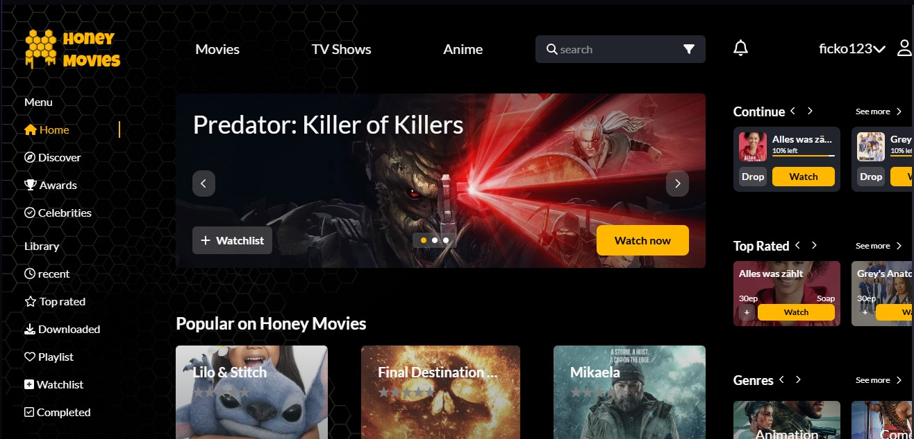
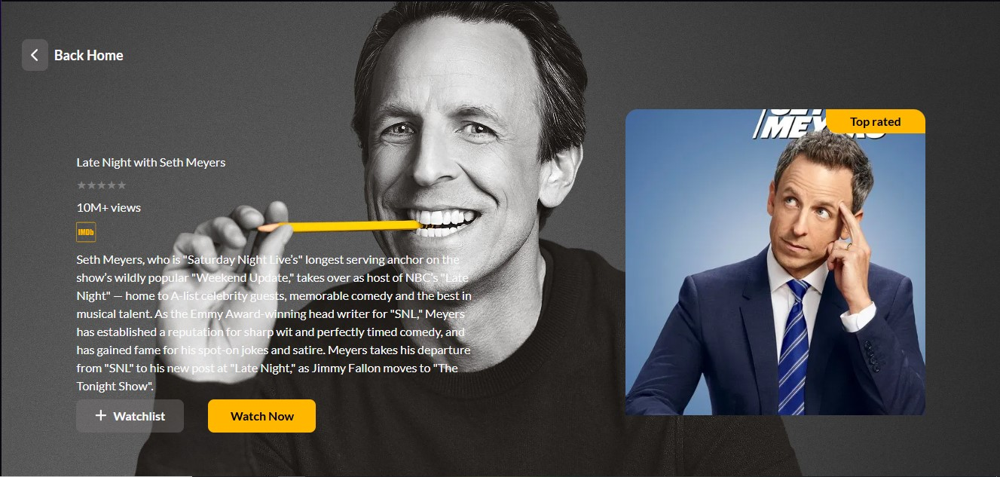

# Honey Movies
## Movie streaming web-app

- A modern movie streaming web application built using **react** powered by [TMDB API](https://www.themoviedb.org/documentation/api), and styled using **Tailwind CSS**. State management is handled by **Zustand**. The UI was originally based on a Figma design, though the design file is no longer available.

---

## Tech Stack

- **React** – Frontend framework
- **Tailwind CSS** – Utility-first CSS styling
- **Zustand** – Lightweight state management
- **TMDB API** – Movie data source
- **Figma Design** – Initial design inspiration (not included)

---

## 📸 Screenshots

---

## How to use:

### 1. Clone the repo.

git clone https://github.com/FilipAndric33/p2

### 2. Install dependencies.

If you are using npm run npm install, for yarn run yarn install.

### 3. Create a .env file.

Create a .env file and add in your own tmdb API key. The name of the var holding the key should be VITE_REACT_APP_API_BEARER=**your key**

### 4. Start the frontend server.

Run npm run dev in the root directory.

### 5. Account creation and adding to the watchlist.

If you wish to create an account and log in, you need to run the backend server (https://github.com/FilipAndric33/p2_server)